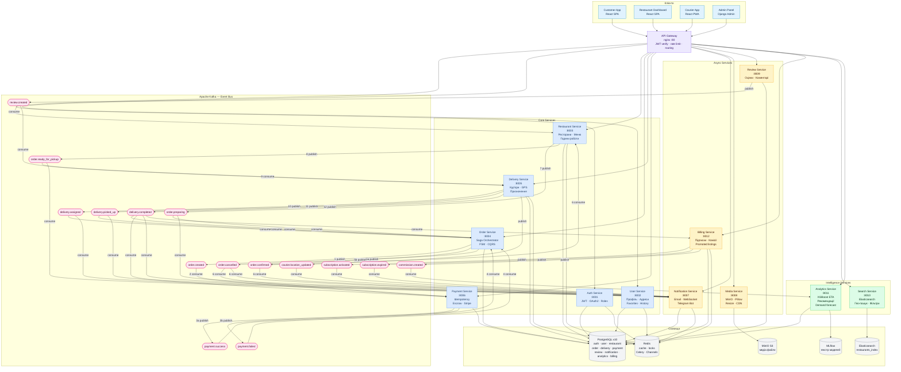

# 🚀 Tastify 

> **Distributed Food Delivery Platform**

```mermaid
flowchart TB

    subgraph CLIENTS["Клієнти"]
        CA["Customer App\nReact SPA"]
        RA["Restaurant Dashboard\nReact SPA"]
        CO["Courier App\nReact PWA"]
        AD["Admin Panel\nDjango Admin"]
    end

    GW["API Gateway\nnginx :80\nJWT verify · rate limit · routing"]

    subgraph CORE["Core Services"]
        AU["Auth Service\n:8001\nJWT · OAuth2 · Roles"]
        US["User Service\n:8002\nПрофіль · Адреси\nFavorites · History"]
        RS["Restaurant Service\n:8003\nРесторани · Меню\nГодини роботи"]
        OR["Order Service\n:8004\nSaga Orchestrator\nFSM · CQRS"]
        DL["Delivery Service\n:8005\nКур'єри · GPS\nПризначення"]
        PM["Payment Service\n:8006\nIdempotency\nEscrow · Stripe"]
    end

    subgraph ASYNC["Async Services"]
        NT["Notification Service\n:8007\nEmail · WebSocket\nTelegram Bot"]
        MD["Media Service\n:8008\nMinIO · Pillow\nResize · CDN"]
        RV["Review Service\n:8009\nОцінки · Коментарі"]
        BL["Billing Service\n:8012\nПідписки · Комісії\nPromoted listings"]
    end

    subgraph INTEL["Intelligence Services"]
        SR["Search Service\n:8010\nElasticsearch\nГео-пошук · Фільтри"]
        AN["Analytics Service\n:8011\nXGBoost ETA\nРекомендації\nDemand forecast"]
    end

    subgraph KAFKA["Apache Kafka — Event Bus"]
        K1(["order.created"])
        K2(["payment.success"])
        K3(["payment.failed"])
        K4(["order.confirmed"])
        K5(["order.cancelled"])
        K6(["order.preparing"])
        K7(["order.ready_for_pickup"])
        K8(["delivery.assigned"])
        K9(["delivery.picked_up"])
        K10(["delivery.completed"])
        K11(["courier.location_updated"])
        K12(["review.created"])
        K13(["subscription.activated"])
        K14(["subscription.expired"])
        K15(["commission.created"])
    end

    subgraph STORAGE["Сховища"]
        PG[("PostgreSQL x10\nauth · user · restaurant\norder · delivery · payment\nreview · notification · analytics · billing")]
        RD[("Redis\ncache · locks\nCelery · Channels")]
        ES[("Elasticsearch\nrestaurants_index")]
        MN[("MinIO S3\nмедіа файли")]
        MF[("MLflow\nreєстр моделей")]
    end

    CA --> GW
    RA --> GW
    CO --> GW
    AD --> GW

    GW --> AU
    GW --> US
    GW --> RS
    GW --> OR
    GW --> DL
    GW --> PM
    GW --> NT
    GW --> MD
    GW --> RV
    GW --> SR
    GW --> AN
    GW --> BL

    OR -- "1 publish" --> K1
    K1 -- "2 consume" --> PM
    PM -- "3a publish" --> K2
    PM -- "3b publish" --> K3
    K2 -- "4 consume" --> OR
    K3 -- "4 consume" --> OR
    OR -- "5a publish" --> K4
    OR -- "5b publish" --> K5
    K4 -- "6 consume" --> RS
    K4 -- "6 consume" --> NT
    K5 -- "6 consume" --> PM
    K5 -- "6 consume" --> NT
    RS -- "7 publish" --> K6
    RS -- "8 publish" --> K7
    K6 -- "consume" --> OR
    K6 -- "consume" --> NT
    K7 -- "9 consume" --> DL
    K7 -- "consume" --> NT
    DL -- "10 publish" --> K8
    DL -- "11 publish" --> K9
    DL -- "12 publish" --> K10
    DL -- "publish" --> K11
    K8 -- "consume" --> OR
    K8 -- "consume" --> NT
    K9 -- "consume" --> OR
    K9 -- "consume" --> NT
    K10 -- "consume" --> OR
    K10 -- "consume" --> PM
    K10 -- "consume" --> NT
    K11 -- "consume" --> NT
    RV -- "publish" --> K12
    K12 -- "consume" --> RS
    K12 -- "consume" --> DL

    K10 -- "consume" --> BL
    BL -- "publish" --> K13
    BL -- "publish" --> K14
    BL -- "publish" --> K15
    K13 -- "consume" --> NT
    K14 -- "consume" --> NT
    K15 -- "consume" --> AN

    AU --> PG
    US --> PG
    RS --> PG
    OR --> PG
    DL --> PG
    PM --> PG
    RV --> PG
    NT --> PG
    AN --> PG
    BL --> PG
    AU --> RD
    US --> RD
    DL --> RD
    RS --> RD
    NT --> RD
    BL --> RD
    SR --> ES
    MD --> MN
    AN --> MF

    classDef coreStyle fill:#dbeafe,stroke:#3b82f6,color:#1e3a5f
    classDef asyncStyle fill:#fef3c7,stroke:#f59e0b,color:#451a03
    classDef intelStyle fill:#dcfce7,stroke:#22c55e,color:#052e16
    classDef kafkaStyle fill:#fce7f3,stroke:#ec4899,color:#500724
    classDef storageStyle fill:#f3f4f6,stroke:#6b7280,color:#111827
    classDef gatewayStyle fill:#ede9fe,stroke:#8b5cf6,color:#2e1065
    classDef clientStyle fill:#e0f2fe,stroke:#0284c7,color:#0c2a4a

    class AU,US,RS,OR,DL,PM coreStyle
    class NT,MD,RV,BL asyncStyle
    class SR,AN intelStyle
    class K1,K2,K3,K4,K5,K6,K7,K8,K9,K10,K11,K12,K13,K14,K15 kafkaStyle
    class PG,RD,ES,MN,MF storageStyle
    class GW gatewayStyle
    class CA,RA,CO,AD clientStyle
```